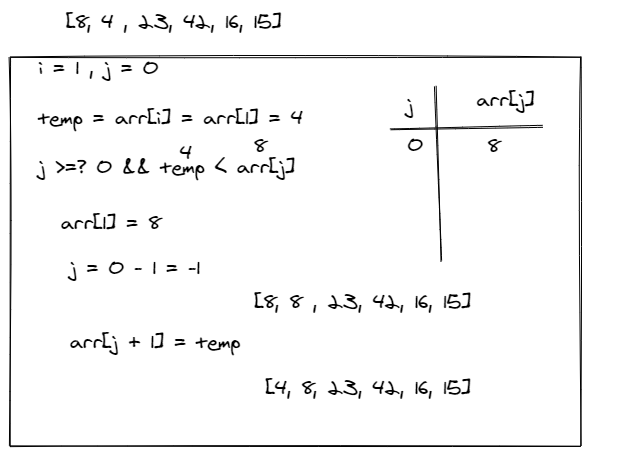
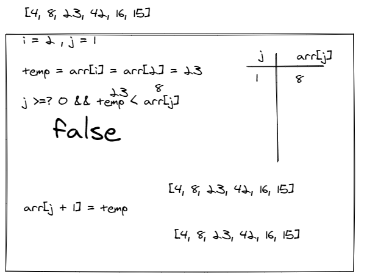
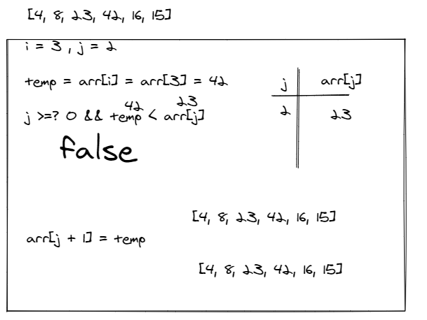
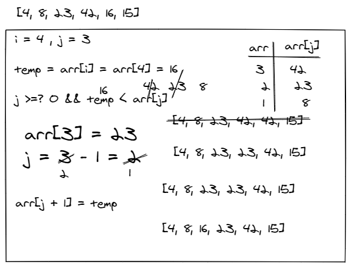
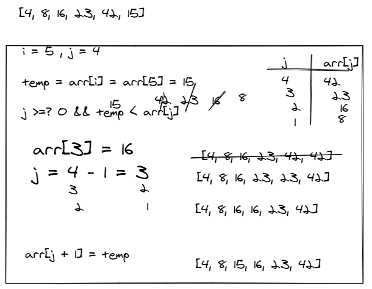

## Insertion Sort

Insertion Sort is a sorting algorithm that traverses the array multiple times. The traversal keeps track of the minimum value and places it in the front of the array which should be incrementally sorted.

## Pseudocode

        InsertionSort(int[] arr)

            FOR i = 1 to arr.length

            int j <-- i - 1
            int temp <-- arr[i]

            WHILE j >= 0 AND temp < arr[j]
                arr[j + 1] <-- arr[j]
                j <-- j - 1

            arr[j + 1] <-- temp

## Trace

Sample Array: `[8,4,23,42,16,15]`

**Pass 1**:

In the first pass through of the insertion sort, we evaluate if there is a bigger number in the array than what is currently present in index 1. We find this bigger number right away in index 0. The minimum value gets updated to remember this index. At the end of the evaluation, the bigger number will be swapped with the current value in index i. This results in our smallest number of our array being placed first.

**Pass 2**:

The second pass through the array evaluates the remaining values in the array to see if there is a bigger value other than the current position of i. 8 is the 2nd smallest number in the array, so it “swaps” with itself.

**Pass 3**:

In the third pass the array will remain the same because there is no bigger value than 42 before index 3.

**Pass 4**:

The 4th pass on the array moves 23 and 42 one index step for each number and replace the value in index 2 with 16.

**Pass 5**:

The 4th pass on the array moves 23, 42, and 16 one index step for each number and replace the value in index 2 with 15.

---

## Efficency

- Time: O(n^2)

  - The basic operation of this algorithm is comparison. This will happen n \* (n-1) number of times…concluding the algorithm to be n squared.

- Space: O(1)
  - No additional space is being created. This array is being sorted in place…keeping the space at constant O(1).

---

## Links

[Working Code](../code-challenges/insertion-sort/index.js)

[Testing Unit](../code-challenges/__test__/insertionSort.test.js)
