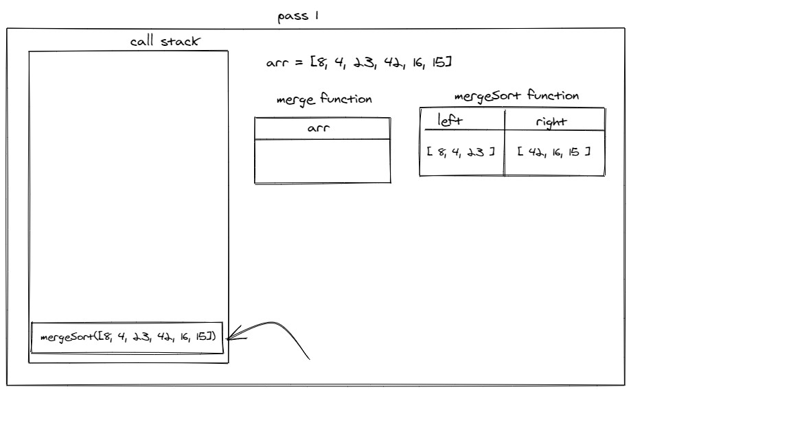
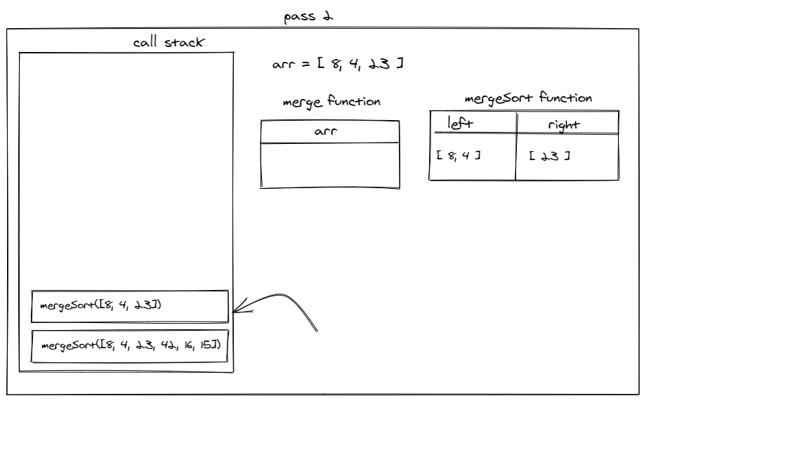
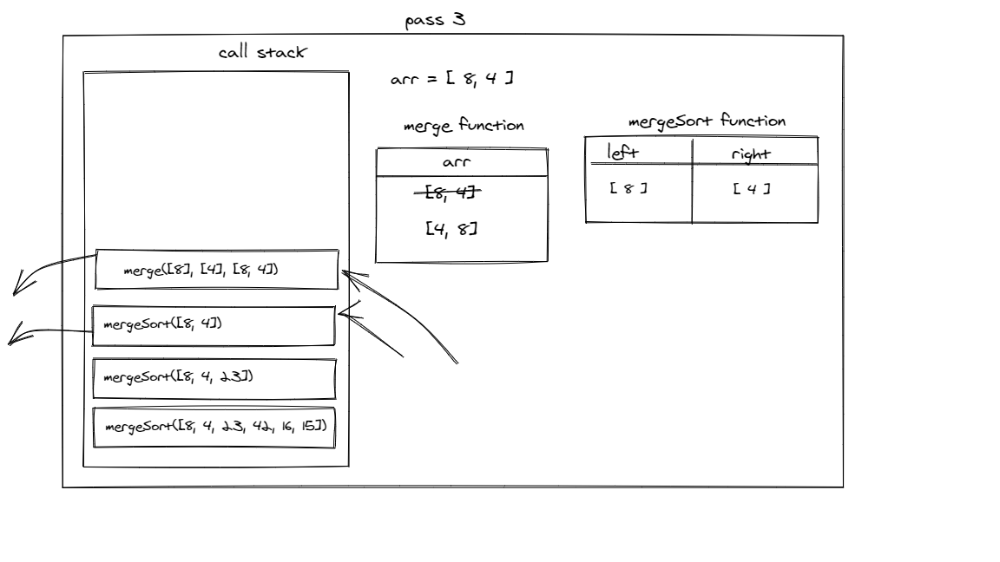
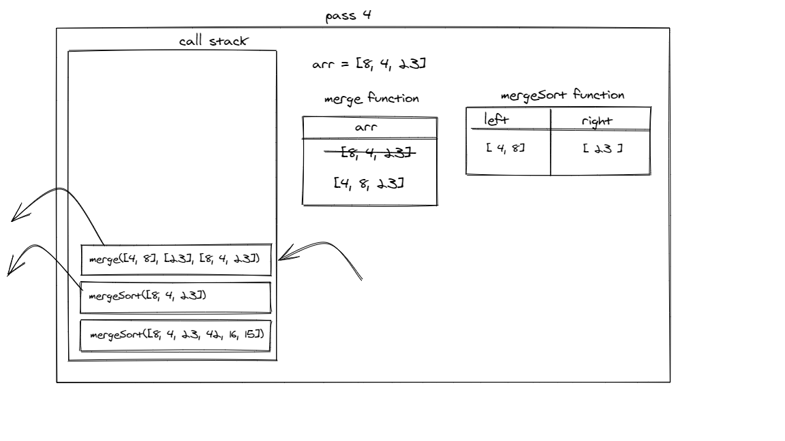
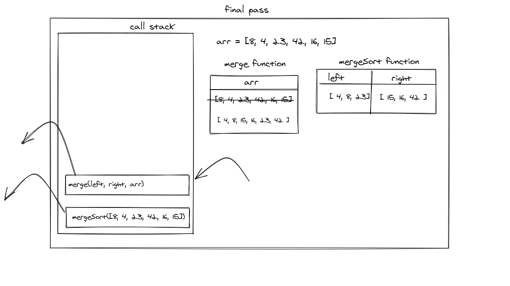

## Merge Sort

Merge Sort is a sorting algorithm that splits the array two half. Then call the recursion function with the splitted till each half being sorted then merge them again to have the original array sorted.

## Pseudocode

            ALGORITHM Mergesort(arr)
        DECLARE n <-- arr.length

        if n > 1
        DECLARE mid <-- n/2
        DECLARE left <-- arr[0...mid]
        DECLARE right <-- arr[mid...n]
        // sort the left side
        Mergesort(left)
        // sort the right side
        Mergesort(right)
        // merge the sorted left and right sides together
        Merge(left, right, arr)

    ALGORITHM Merge(left, right, arr)
        DECLARE i <-- 0
        DECLARE j <-- 0
        DECLARE k <-- 0

        while i < left.length && j < right.length
            if left[i] <= right[j]
                arr[k] <-- left[i]
                i <-- i + 1
            else
                arr[k] <-- right[j]
                j <-- j + 1

            k <-- k + 1

        if i = left.length
        set remaining entries in arr to remaining values in right
        else
        set remaining entries in arr to remaining values in left

## Trace

Sample Array: `[8,4,23,42,16,15]`

---

**Call 1**:

<!--  -->

In the first call the function will split the array for two array then call back the function with the left value.

---

**Call 2**:

In the second call the function will split the passed array which is `[8, 4, 23]` for left `[8, 4]` and right `[23]`. then the call stack added a new recursion function call with the left array

---

**Call 3**:

In the third call the function will split the passed array (`[8, 4]`), then will call merge function with `([8], [4], [8, 4])`. Merge function will sort the passed array to be `[4, 8]`, then the call stack will empty the recently called functions and remains just two in the call stack.

---

**Call 4**:

Now as the call stack order merge function will be added with `([4, 8], [23], [8, 4, 23])`. then merge function will sort the left of the original array to be `[4, 8, 23]`, and the call stack will empty the last two called functions.

---

**Final Call**:

The same previous operations will be for the right side of the original array to be after the sort `[15, 16, 42]`. then merge function will be called for the last time with `([4, 8, 23], [15, 16, 42], [8, 4, 23, 42, 16, 15])` arguments then it will sort the original array to be `[4, 8, 15, 16, 23, 42]`

---

## Efficency

- Time: O(n^2)

- Space: O(2)

---

## Links

[Working Code](../code-challenges/merge-sort/index.js)

[Testing Unit](../code-challenges/__test__/mergeSort.test.js)
