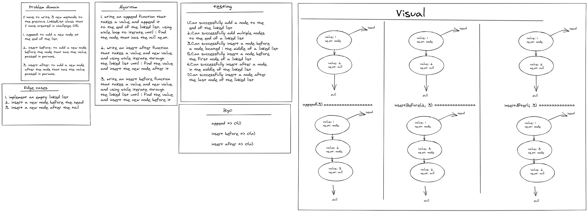

# Challenge Summary

<!-- Description of the challenge -->

- I have to write 3 new methods to the previos LinkedList class that I have created in challenge 05:

1. append: to add a new node at the end of the list.

2. insert before: to add a new node before the node that has the value passed in params.

3. insert after: to add a new node after the node that has the value passed in params.

---

## Whiteboard Process

<!-- Embedded whiteboard image -->

---

## Approach & Efficiency

<!-- What approach did you take? Why? What is the Big O space/time for this approach? -->

append => O(1)

insert before => O(n)

insert after => O(n)

---

## Solution

<!-- Show how to run your code, and examples of it in action -->

[click to see the code](../code-challenges/)
