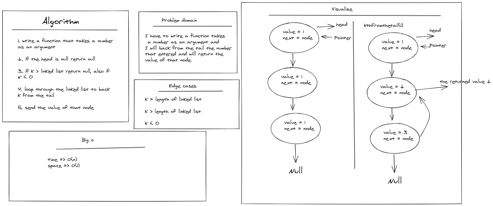

# Challenge Summary
<!-- Description of the challenge -->

I have to write a function takes 
 a number as an argument and 
I will back from the tail the number 
that entered and will return the 
value of that node  

---

## Whiteboard Process
<!-- Embedded whiteboard image -->

---

## Approach & Efficiency
<!-- What approach did you take? Why? What is the Big O space/time for this approach? -->

time => O(n)
space => O(1)

---

## Solution
<!-- Show how to run your code, and examples of it in action -->

[click to see the code](./code-challenges/)