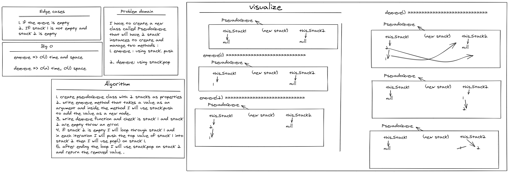

# Challenge Summary

<!-- Description of the challenge -->

I have to create a new
class called PseudoQueue
that will have 2 stack
instances to create and
manage two methods :

1. enqueue : using stack. push

2. dequeue: using stack.pop

---

## Whiteboard Process

<!-- Embedded whiteboard image -->

---

## Approach & Efficiency

<!-- What approach did you take? Why? What is the Big O space/time for this approach? -->

- enqueue =>
  time => O(1)
  space => O(1)

- dequeue =>
  time => O(n)
  space => O(1)

---

## Solution

<!-- Show how to run your code, and examples of it in action -->

- You can find the code for this challenge inside Stack&Queue folder

[Complete code files](../code-challenges/)

[PseudoQueue.js](../code-challenges/Stack&Queue/PseudoQueue.js)
