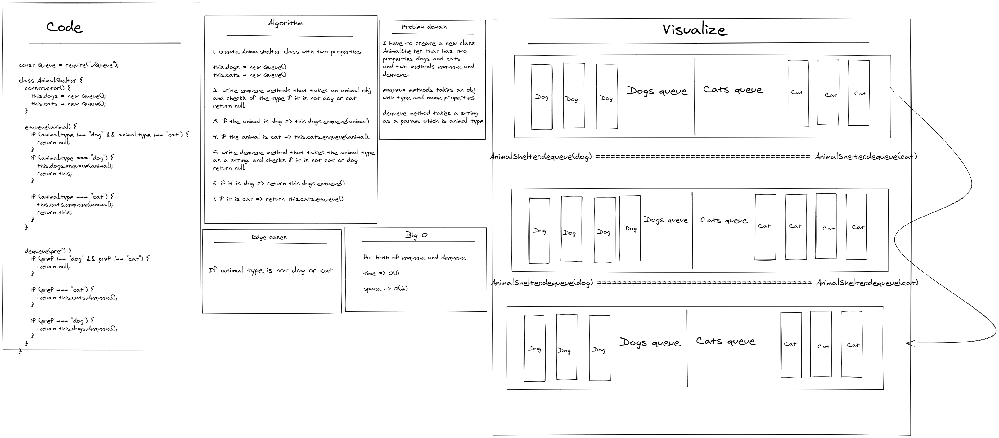

# Challenge Summary

<!-- Description of the challenge -->

1. create Animalshelter class with two properties:

this.dogs = new Queue()
this.cats = new Queue()

2. write enqueue methods that takes an animal obj
   and checks of the type if it is not dog or cat
   return null.

3. if the animal is dog => this.dogs.enqueue(animal).

4. if the animal is cat => this.cats.enqueue(animal).

5. write dequeue method that takes the animal type
   as a string. and checks if it is not cat or dog
   return null.

6. if it is dog => return this.dogs.enqueue()

7. if it is cat => return this.cats.enqueue()

---

## Whiteboard Process

<!-- Embedded whiteboard image -->

---

## Approach & Efficiency

<!-- What approach did you take? Why? What is the Big O space/time for this approach? -->

- enqueue =>

  time => O(1)

  space => O(1)

- dequeue =>

  time => O(1)

  space => O(1)

---

## Solution

<!-- Show how to run your code, and examples of it in action -->

- You can find the code for this challenge inside Stack&Queue folder

[Complete code files](../code-challenges/)

[AnimalShelter.js](../code-challenges/Stack&Queue/AnimalShelter.js)
