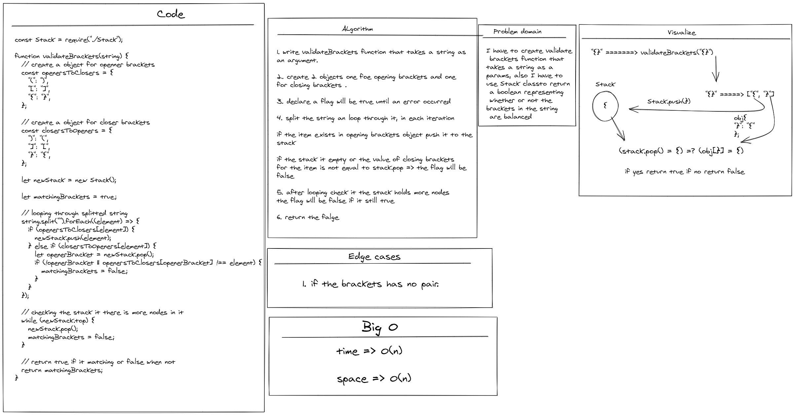

# Challenge Summary

<!-- Description of the challenge -->

- I have to create validate brackets function that takes a string as a params, also I have to use Stack classto return a boolean representing whether or not the brackets in the string are balanced

---

## Whiteboard Process

<!-- Embedded whiteboard image -->

---

## Approach & Efficiency

<!-- What approach did you take? Why? What is the Big O space/time for this approach? -->

time => O(n)

space => O(n)

---

## Solution

<!-- Show how to run your code, and examples of it in action -->

- You can find the code for this challenge inside Stack&Queue folder

[Complete code files](../code-challenges/)

[brackets.js](../code-challenges/Stack&Queue/brackets.js)
