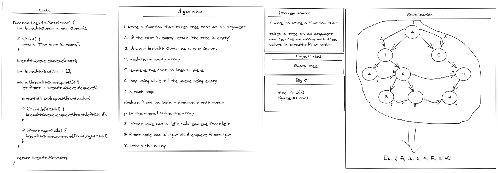

# Challenge Summary

<!-- Description of the challenge -->

- I have to write a function that
  takes a tree as an argument
  and returns an array with tree
  values in breadth first order

---

## Whiteboard Process

<!-- Embedded whiteboard image -->

---

## Approach & Efficiency

<!-- What approach did you take? Why? What is the Big O space/time for this approach? -->

time => O(n)

space => O(n)

---

## Solution

<!-- Show how to run your code, and examples of it in action -->

- You can find the code for this challenge inside Stack&Queue folder

[Complete code files](../code-challenges/)

[breadthFirst.js](../code-challenges/trees/breadthFirst.js)
