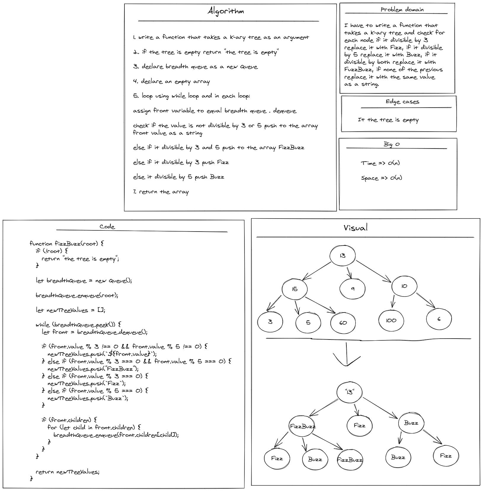

# Challenge Summary

<!-- Description of the challenge -->

- I have to write a function that
  takes a k-ary tree and check for
  each node if it divisible by 3
  replace it with Fizz, if it divisible
  by 5 replace it with Buzz, if it
  divisible by both replace it with
  FuzzBuzz, if none of the previous
  replace it with the same value
  as a string.

---

## Whiteboard Process

<!-- Embedded whiteboard image -->

---

## Approach & Efficiency

<!-- What approach did you take? Why? What is the Big O space/time for this approach? -->

time => O(n)

space => O(n)

---

## Solution

<!-- Show how to run your code, and examples of it in action -->

- You can find the code for this challenge inside Stack&Queue folder

[Complete code files](../code-challenges/)

[fizzbuzz.js](../code-challenges/trees/fizzbuzz.js)
