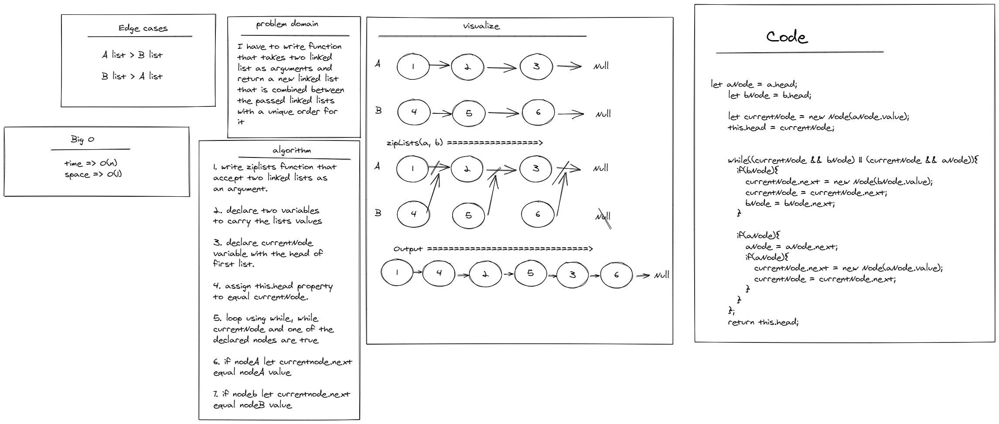

# Challenge Summary
<!-- Description of the challenge -->

I have to write function 
that takes two linked 
list as arguments and 
return a new linked list
that is combined between 
the passed linked lists
with a unique order for
it  

---

## Whiteboard Process
<!-- Embedded whiteboard image -->

---

## Approach & Efficiency
<!-- What approach did you take? Why? What is the Big O space/time for this approach? -->

time => O(n)

space => O(1)

---

## Solution
<!-- Show how to run your code, and examples of it in action -->

[click to see the code](./code-challenges/)